# TARS

TARS is the shared home for local multi-agent orchestration: reusable skills,
durable handoff protocols, and automation that coordinate OpenCode and Codex
through Agent of Empires (AoE).

Its current workflow creates one lane per git worktree. OpenCode implements;
Codex reviews immutable commits; TARS wakes the correct existing session until
the approved branch is ready for a pull request.

## Prerequisites

Before continuing, make sure the following commands are available in the
environment where AoE launches agent sessions:

- A recent [Node.js runtime](https://nodejs.org/en/download) with `node:sqlite`
  support.
- [tmux](https://github.com/tmux/tmux/wiki/Installing) and
  [Agent of Empires (AoE)](https://github.com/agent-of-empires/agent-of-empires/blob/main/docs/installation.md)
  installed and usable as `aoe`. AoE's tmux-backed sessions must be able to
  launch both `opencode` and `codex` from their environment.
- [OpenCode](https://opencode.ai/docs) and
  [Codex](https://learn.chatgpt.com/docs/codex/cli) installed and authenticated.
  If Codex comes from the ChatGPT desktop app, expose its executable on `PATH`
  before launching AoE.
- [GitHub CLI (`gh`)](https://cli.github.com/manual/) authenticated for the
  target project; `lane start` reads the issue title and body.
- A target Git repository whose OpenCode global skills describe how to work its
  issues (for example, its issue-kickoff workflow).

## One-time setup

Clone TARS, then install the default TARS skills and command for fresh agent
sessions with one command:

```bash
git clone https://github.com/satwikhebbar/tars.git
cd tars

node setup.mjs
```

To install skills selectively, use the skill installer directly:

```bash
# Install or update one Codex skill.
node skills/install.mjs codex handoff-review --force

# Install an additional OpenCode skill used by your project.
node skills/install.mjs opencode close-issue --force
```

`setup.mjs` updates the default TARS-managed skills and command each time it
runs. Selective installers copy skills into the agent's global configuration,
so use `--force` when updating one that is already installed. Start new AoE
sessions after an update; an already-running agent may still have its earlier
skill instructions in context.

## Start using TARS

Run one long-lived watcher from the TARS checkout. It serves every registered
lane and prints only dispatched handoff events, so quiet output means no new
handoff needed delivery.

```bash
node automations/review-loop/cli.mjs watch
```

In another terminal, create a lane for an issue. TARS asks OpenCode for a
bounded branch/worktree suggestion, lets AoE create the worktree and sessions,
then sends OpenCode the appropriate opening prompt:

```bash
node automations/review-loop/cli.mjs lane start \
  --repo /absolute/path/to/main-checkout \
  --issue 44 \
  --planning auto
```

Use `--planning always` to require a plan-first lane, or `--planning never`
for direct implementation. A plan-first lane can use a configured planning
model:

```bash
node automations/review-loop/cli.mjs lane start \
  --repo /absolute/path/to/main-checkout \
  --issue 44 \
  --planning always \
  --plan-model deepseek/deepseek-v4-pro
```

Use a provider/model identifier understood by OpenCode, such as
`deepseek/deepseek-v4-pro`.

TARS prints the worktree path, OpenCode session ID, Codex session ID, and
branch. Use AoE's normal tmux interface to observe either session; do not
create a second implementer session for the same lane.

## Review-loop lifecycle

```mermaid
flowchart TD
  subgraph plan_first["Plan-first lane"]
    plan["OpenCode writes a plan"] --> plan_handoff["Plan-review handoff"]
    plan_handoff --> plan_review["Codex reviews the plan"]
    plan_review --> plan_approved["Approved verdict + iteration schedule"]
    plan_approved --> start_iteration["TARS starts iteration 1 in Build mode"]
    start_iteration --> build["OpenCode commits an implementation response"]
    build --> code_review["Codex reviews the code"]
    code_review -->|"Changes requested"| revise["OpenCode revises the same iteration"]
    revise --> build
    code_review -->|"Approved; more iterations remain"| next_iteration["TARS starts the next iteration"]
    next_iteration --> build
    code_review -->|"Final approval"| create_pr["OpenCode pushes the branch and creates a PR"]
  end

  subgraph direct_build["Direct-build lane"]
    direct_commit["OpenCode commits an implementation response"] --> direct_review["Codex reviews the code"]
    direct_review -->|"Changes requested"| direct_revise["OpenCode revises and commits"]
    direct_revise --> direct_commit
    direct_review -->|"Approved"| direct_pr["OpenCode pushes the branch and creates a PR"]
  end

  subgraph pr_feedback["Existing PR feedback"]
    feedback["Ask OpenCode to use address-pr-feedback"] --> follow_up["OpenCode commits a marked follow-up handoff"]
    follow_up --> reopen["TARS reopens the approved lane for Codex review"]
    reopen --> feedback_review["Codex reviews the follow-up"]
    feedback_review -->|"Changes requested"| feedback_revise["OpenCode repairs and commits"]
    feedback_revise --> follow_up
    feedback_review -->|"Approved"| feedback_push["OpenCode pushes the follow-up to the existing PR"]
  end
```



Codex uses an approved plan verdict to recommend the smallest sensible set of
independently buildable and testable iterations. TARS stores the current
iteration per worktree, so multiple plan-first and direct-build lanes can
advance concurrently without crossing handoffs.

After you or a GitHub-integrated reviewer leaves feedback on an approved PR,
ask the lane's existing OpenCode session to use `address-pr-feedback`. It reads
the existing PR feedback, commits and publishes an explicit reopen handoff, and
leaves delivery to the shared watcher. No second lane or pull request is made.

## Day-to-day lane commands

```bash
# Inspect all persisted lanes.
node automations/review-loop/cli.mjs status

# Register an already-created AoE OpenCode/Codex pair; the shared watcher serves it.
node automations/review-loop/cli.mjs lane register --worktree /absolute/path/to/worktree

# Start a one-off watcher while registering an existing pair (advanced use).
node automations/review-loop/cli.mjs start --worktree /absolute/path/to/worktree

# Retire a merged, approved lane. AoE removes its own worktree and branch.
node automations/review-loop/cli.mjs lane close --issue 44

# Abort only after both registered AoE panes have been stopped and are dead.
node automations/review-loop/cli.mjs lane close --issue 44 --force
```

See the [review-loop reference](automations/review-loop/README.md) for all
flags, persisted state, and handoff metadata. The canonical skill packages are
under [`skills/`](skills/), and the tool-neutral handoff contract is under
[`protocols/`](protocols/).
